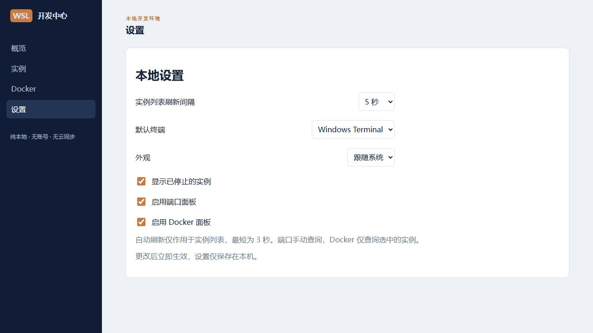

# WSL 开发中心

一个纯本地的中文 Windows WSL/WSL2 开发环境管理器，使用 Tauri 2、React、TypeScript 和 Rust 构建。

## 功能

- 查看实例名称、运行状态、WSL 版本和默认实例，兼容中文列表与带空格的名称。
- 启动、停止、重启实例；关闭所有 WSL 前弹出确认框，默认焦点为取消。
- 打开 Windows Terminal、PowerShell、实例文件目录和 VS Code Remote WSL。
- 查看运行中实例的内存、磁盘、运行时间和进程数量；分别显示查询错误。
- 手动查看监听端口，支持 ss 和 netstat 回退、复制地址、打开常见本地 HTTP 端口。
- 按选定实例查看 Docker 容器，支持启动、停止和最近 200 行日志。
- 本地保存刷新间隔、面板开关、默认终端、已停止实例显示与浅色／深色／系统主题。

实现状态与实机验收结果见 [进度记录](docs/PROGRESS.md)。代码实现和自动化测试通过不等于全部实机验收完成。

## 安装开发依赖

Windows 开发环境需要：

1. Node.js 与 pnpm。
2. Rust 的 Windows MSVC 工具链（通过 rustup 安装）。
3. Visual Studio Build Tools 2022，选择“使用 C++ 的桌面开发”，包含 MSVC x64/x86 工具和 Windows SDK。
4. Microsoft Edge WebView2 Runtime。
5. 已启用的 WSL 和至少一个发行版，用于真实功能验证。

可选：Windows Terminal、VS Code 和 WSL 扩展，以及发行版内的 Docker、ss 或 netstat。

安装依赖：

```powershell
pnpm install --frozen-lockfile
```

项目统一使用 pnpm。仓库中原有未跟踪的 package-lock.json 不作为本项目依赖锁文件。

## 开发与构建

```powershell
# 桌面开发模式
pnpm tauri dev

# 仅预览前端界面；浏览器不具备 WSL 系统调用能力
pnpm dev

# 前端检查、测试与构建
pnpm test
pnpm build

# Rust 单元测试与格式检查
cargo test --manifest-path src-tauri/Cargo.toml
cargo fmt --manifest-path src-tauri/Cargo.toml -- --check

# Windows 安装包
pnpm tauri build
```

构建产物位于 `src-tauri/target/release/bundle/`。首次安装依赖及首次打包可能需要联网下载开发工具；应用业务数据不上传。

如果 Rust 已安装但当前终端无法找到 cargo，重新打开终端，或在当前 PowerShell 中运行：

```powershell
$env:Path = "$env:USERPROFILE\.cargo\bin;$env:Path"
cargo --version
```

如果提示找不到 `link.exe`，检查是否已安装 C++ 构建工具和 Windows SDK；必要时使用 Visual Studio 的 Developer PowerShell。

## 使用说明

实例页默认每 5 秒刷新，可调整为手动、3 秒或 10 秒；页面不可见时暂停轮询。端口仅手动查询。Docker 只查询用户选择的实例，不扫描全部实例。

详情地址使用适配桌面应用的哈希路由，例如 `#/machines/Ubuntu`。查看已停止实例不会主动启动它；需要先明确点击启动。

文件入口遵循计划，打开 `\\wsl$\实例名\home`；VS Code 打开该实例的 `/home`。这些入口不是自动解析当前 Linux 用户的个人主目录。

Docker 状态、资源文本和原始错误保持系统输出，操作按钮及应用提示使用中文。Docker 服务未启动和权限不足不会被统一误报为未安装。

## 安全与隐私

本项目不含账号、不含登录或注册、不含云同步、不含远程管理、不含遥测，不提供 HTTPS 或证书管理，不暴露公网访问入口。

所有 WSL、Docker、端口和进程信息保留在本机。应用不自动修改 hosts、防火墙、系统证书或 `/etc`，不自动 sudo，不提供任意命令输入框。

WSL 实例名称通过独立参数传递；终端回退的脚本固定，实例名通过环境变量传递。Docker 操作前重新核对容器列表，不提供删除容器、镜像或数据卷的功能。

## 基础截图

以下为浏览器中的中文设置页预览，不代表桌面端 WSL 功能已完成实机验收。



